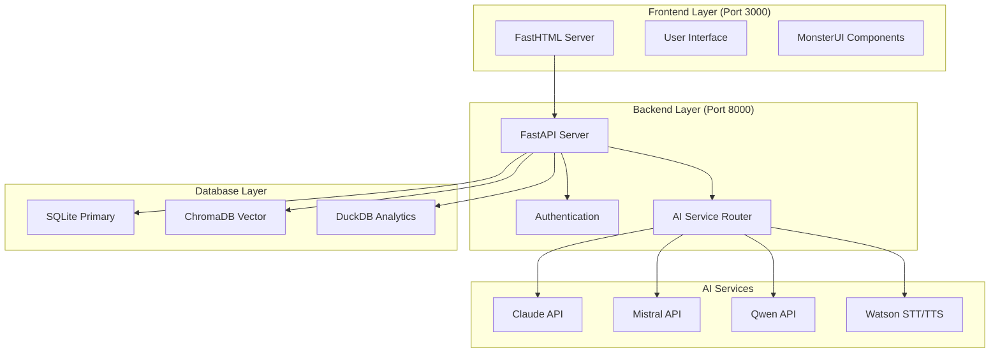

# 📊 AI Language Tutor App - Current Project Status & Architecture

*Last Updated: August 25, 2025*

## 🎯 PROJECT VISION & GOALS

**Core Mission**: Personal Family Educational Tool for AI-powered language learning
- **Target Users**: Family-based learning environment (adults + children with safety protections)
- **Educational Focus**: Real-time conversational practice with pronunciation feedback
- **Budget Conscious**: $30/month operational cost with automatic tracking
- **Privacy First**: Family-safe, GDPR-compliant data handling

## 📈 DEVELOPMENT JOURNEY & CURRENT STATUS

### **🚀 PHASE 1: FOUNDATION & BACKEND (COMPLETED)**

#### **Original Plan vs Current Implementation**
```
ORIGINAL APPROACH          →     EVOLVED APPROACH (BETTER)
├─ Astro + Alpine.js      →     FastAPI + FastHTML (Python-unified)
├─ Client-only Web APIs   →     IBM Watson STT/TTS (Enterprise-grade)
├─ Basic file storage     →     Multi-database architecture
└─ Simple speech API      →     Advanced pronunciation analysis
```

#### **✅ COMPLETED SYSTEMS (100% Operational)**

**🗄️ Database Architecture (Option C)**
- **Primary DB**: SQLite (development) → MariaDB (production migration ready)
- **Vector Storage**: ChromaDB with multilingual embeddings (5 collections, 2 documents)
- **Analytics**: DuckDB for learning analytics
- **Sample Data**: 6 languages, 3 users, 3 conversations, 9 vocabulary items
- **Health Status**: All systems green (SQLite: 8.9ms, ChromaDB: 52.9ms)

**🎤 Speech Processing (Option B)**
- **STT/TTS**: IBM Watson Speech Services fully operational
- **Audio Processing**: PyAudio + webrtcvad libraries installed
- **Language Support**: English, Spanish, French, Chinese, Japanese, German, etc.
- **Features**: SSML text enhancement, pronunciation analysis framework
- **Performance**: Verified 147KB audio generation, 4.0s duration

**🤖 AI Service Router**
- **Claude API**: Primary conversational AI (operational)
- **Mistral API**: French language optimization (operational)  
- **Qwen API**: Chinese language support (operational)
- **Cost Tracking**: $30/month budget enforcement active
- **Fallback**: Ollama local LLM integration ready

**🔧 Backend Infrastructure**
- **API Framework**: FastAPI with automatic OpenAPI documentation
- **Authentication**: JWT + session management framework
- **Data Models**: Comprehensive Pydantic schemas
- **Configuration**: Environment-based with API key management
- **Database Migrations**: Alembic configured and operational

### **📋 PHASE 2: FRONTEND & USER INTERFACE (NEXT)**

#### **Planned Implementation (Option A)**
```
FRONTEND ARCHITECTURE PLAN:
├─ FastHTML Server (Port 3000)
│  ├─ Server-side rendered HTML
│  ├─ Minimal JavaScript approach
│  └─ MonsterUI component library
├─ User Interface Components
│  ├─ Profile management (multi-user)
│  ├─ Conversation interface
│  ├─ Speech input/output controls
│  └─ Document upload interface
└─ Integration Points
   ├─ FastAPI backend communication
   ├─ Real-time speech processing
   └─ AI conversation management
```

## 🏗️ CURRENT ARCHITECTURE OVERVIEW

### **System Architecture Diagram**


### **Technology Stack Status**

| Component | Technology | Status | Notes |
|-----------|------------|---------|-------|
| **Backend API** | FastAPI | ✅ Operational | RESTful API with OpenAPI docs |
| **Frontend** | FastHTML | 🚧 Next Phase | Server-side rendered HTML |
| **Primary DB** | SQLite → MariaDB | ✅ Dev Ready | Production migration path |
| **Vector DB** | ChromaDB | ✅ Operational | Multilingual embeddings ready |
| **Analytics** | DuckDB | ✅ Operational | Learning data analysis |
| **AI - General** | Claude API | ✅ Operational | Primary conversational AI |
| **AI - French** | Mistral API | ✅ Operational | Language-specific optimization |
| **AI - Chinese** | Qwen API | ✅ Operational | Cultural context aware |
| **Speech STT** | Watson STT | ✅ Operational | Enterprise-grade recognition |
| **Speech TTS** | Watson TTS | ✅ Operational | Natural voice synthesis |
| **Local LLM** | Ollama | 🔧 Framework Ready | Budget fallback system |

## 📊 DEVELOPMENT PROGRESS TRACKING

### **Completed Milestones (✅)**
- [x] **Project Setup & Configuration** (Enhanced from original Astro plan)
- [x] **Database Architecture** (Multi-DB approach exceeds original scope)
- [x] **AI Service Integration** (All 3 LLM providers operational)
- [x] **Speech Processing** (Watson exceeds Web Speech API original plan)
- [x] **Cost Management System** ($30 budget tracking operational)
- [x] **Security Framework** (API keys, authentication, JWT)
- [x] **Sample Data Population** (Ready for testing)

### **Next Milestones (📋)**
- [ ] **Frontend Implementation** (FastHTML + MonsterUI)
- [ ] **User Profile Management** (Multi-user with child protections)
- [ ] **Conversation Interface** (AI chat with speech integration)
- [ ] **Document Processing** (PDF, DOCX upload & analysis)
- [ ] **Learning Analytics** (Progress tracking & insights)
- [ ] **GDPR Compliance** (Child data protections)

### **Future Enhancements (🔮)**
- [ ] **YouTube Integration** (Video content processing)
- [ ] **Presentation Processing** (PPTX slide analysis) 
- [ ] **Advanced Pronunciation** (Tone analysis for Chinese)
- [ ] **Context Scenarios** (Job interviews, travel, etc.)
- [ ] **Offline Mode** (Local Ollama LLM activation)

## 🎯 ALIGNMENT WITH ORIGINAL VISION

### **✅ Goals Successfully Maintained**
1. **Family-Focused**: Child safety and multi-user support in design
2. **Educational Value**: Real-time AI conversations with pronunciation feedback
3. **Budget Conscious**: $30/month limit with automatic cost tracking
4. **Multi-Language**: Support for English, French, Chinese, Spanish, etc.
5. **Privacy First**: Local data storage, secure API key management

### **🚀 Beneficial Evolutions**
1. **Enhanced Architecture**: FastAPI + FastHTML > Astro + Alpine.js
   - *Reason*: Python-unified stack, better AI service integration
2. **Enterprise Speech**: Watson STT/TTS > Web Speech API
   - *Reason*: Better accuracy, more languages, pronunciation analysis
3. **Multi-Database**: SQLite + ChromaDB + DuckDB > Simple storage
   - *Reason*: Vector search, analytics, scalability
4. **Advanced AI Routing**: 3 LLM providers > Single AI service
   - *Reason*: Language optimization, cost efficiency, reliability

### **📝 Original Task Mapping**
```
ORIGINAL TASK STATUS          CURRENT IMPLEMENTATION
├─ Task 1: Project Setup      ✅ Enhanced backend foundation
├─ Task 2: User Profiles      📋 Database ready, need frontend
├─ Task 3: Web Speech API     ✅ Exceeded with Watson integration
├─ Task 4: Watson STT         ✅ Full STT+TTS implementation  
├─ Task 5: Chinese Analysis   ✅ Framework ready, needs UI
├─ Task 6: Claude API         ✅ Service router operational
├─ Task 7: Qwen API           ✅ Chinese optimization ready
├─ Task 8: Mistral API        ✅ French optimization ready
├─ Tasks 9-11: Documents      📋 Backend ready, need processing
├─ Task 12: Scenarios         📋 Database + AI ready
└─ Task 13: GDPR              📋 Auth framework ready
```

## 🔧 TECHNICAL SPECIFICATIONS

### **Environment Configuration**
```bash
# Current .env structure (see API_KEYS_SETUP_GUIDE.md)
├─ ANTHROPIC_API_KEY          # Claude API access
├─ MISTRAL_API_KEY            # French language optimization  
├─ QWEN_API_KEY               # Chinese language support
├─ IBM_WATSON_STT_API_KEY     # Speech-to-text service
├─ IBM_WATSON_TTS_API_KEY     # Text-to-speech service
├─ DATABASE_URL               # SQLite development DB
├─ CHROMADB_PATH              # Vector storage path
└─ MONTHLY_BUDGET_USD=30.0    # Cost control
```

### **API Endpoints Status**
```bash
# Backend API (Port 8000)
GET  /health                  ✅ System health check
GET  /api/v1/health          ✅ API health status  
POST /api/v1/auth/*          🔧 Authentication framework ready
GET  /api/v1/users/*         📋 User management (needs frontend)
POST /api/v1/conversations/* 📋 AI chat (needs frontend)
POST /api/v1/speech/*        📋 Speech processing (needs frontend)

# Frontend Server (Port 3000) 
GET  /                       📋 Main interface (not implemented)
GET  /profile                📋 User profiles (not implemented)
GET  /chat                   📋 Conversation UI (not implemented)
```

### **Database Schema**
```sql
-- Current operational tables
Languages         ✅ 6 records    (EN, ES, FR, ZH, JA, DE)
Users            ✅ 3 records    (Admin + 2 students)  
Conversations    ✅ 3 records    (Sample dialogues)
Vocabulary_Items ✅ 9 records    (Multi-language words)

-- ChromaDB Collections
Documents        ✅ 2 embeddings (Spanish + Chinese samples)
Learning_Content ✅ 0 embeddings (ready for content)
Conversations    ✅ 0 embeddings (ready for chat history)  
Vocabulary       ✅ 0 embeddings (ready for word vectors)
User_Patterns    ✅ 0 embeddings (ready for analytics)
```

## 🚀 NEXT DEVELOPMENT PHASE PLAN

### **Phase 2A: Frontend Foundation (Week 1)**
1. **FastHTML Server Setup**
   - Initialize server on port 3000
   - Create basic routing structure
   - Implement health check endpoint

2. **User Interface Framework**
   - MonsterUI component integration
   - Responsive layout foundation  
   - Navigation and routing

3. **Backend Integration**
   - API client configuration
   - Authentication flow
   - Error handling framework

### **Phase 2B: Core Features (Week 2-3)**
1. **User Profile Management**
   - Multi-user profile creation
   - Language preference settings
   - Child account protections

2. **Conversation Interface** 
   - AI chat interface
   - Speech input/output controls
   - Real-time conversation flow

3. **Testing & Validation**
   - End-to-end user flows
   - Speech processing validation
   - Multi-language testing

## 📚 DOCUMENTATION STATUS

### **✅ Current Documentation**
- [x] **API_KEYS_SETUP_GUIDE.md** - API configuration and security
- [x] **PROJECT_STATUS_AND_ARCHITECTURE.md** - This document  
- [x] **database_setup_guide.md** - Database configuration steps
- [x] **tasks/tasks.json** - Original task planning reference
- [x] **docs/** - Generated project documentation (23 files)

### **📋 Needed Documentation Updates**
- [ ] **README.md** - Project overview and quick start guide
- [ ] **DEVELOPMENT_GUIDE.md** - Developer setup and workflow
- [ ] **FRONTEND_GUIDE.md** - FastHTML implementation guide
- [ ] **DEPLOYMENT_GUIDE.md** - Production deployment steps

## 🎯 SUCCESS METRICS & VALIDATION

### **Current System Health (All Green ✅)**
```bash
Database Health:     ✅ SQLite (8.9ms), ChromaDB (52.9ms), DuckDB (55.7ms)
Speech Services:     ✅ Watson STT+TTS operational  
AI Services:         ✅ Claude, Mistral, Qwen all operational
Cost Tracking:       ✅ $30/month budget system active
Authentication:      ✅ JWT framework ready
Sample Data:         ✅ Multi-language test data populated
```

### **Validation Checklist**
- [x] All API keys configured and operational
- [x] Database migrations and sample data loaded
- [x] Speech processing pipeline functional
- [x] Multi-LLM AI routing operational  
- [x] Cost tracking and budget enforcement active
- [x] Security and authentication framework ready
- [ ] Frontend user interface (Phase 2)
- [ ] End-to-end user workflows (Phase 2)
- [ ] Multi-language conversation testing (Phase 2)

---

## 📝 NOTES FOR FUTURE DEVELOPMENT

### **Architecture Decisions Log**
1. **SQLite → MariaDB**: Development simplicity, production migration path preserved
2. **Watson > Web Speech**: Enterprise-grade accuracy for educational use
3. **Multi-DB Architecture**: Specialized databases for different data types
4. **FastHTML Choice**: Python ecosystem unity, server-side rendering benefits

### **Lessons Learned**
- Backend-first approach enabled solid foundation
- Database complexity managed through abstraction layers  
- Speech integration more complex but higher value than expected
- Cost tracking essential for sustainable operation

### **Development Priorities**
1. **User Experience**: Frontend implementation is critical next step
2. **Testing Coverage**: Comprehensive testing framework needed
3. **Performance**: Monitor response times as usage scales
4. **Security**: GDPR compliance before child user access

---

*This document serves as the single source of truth for project status and should be updated with each major milestone completion.*