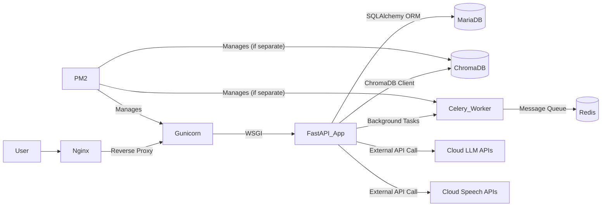
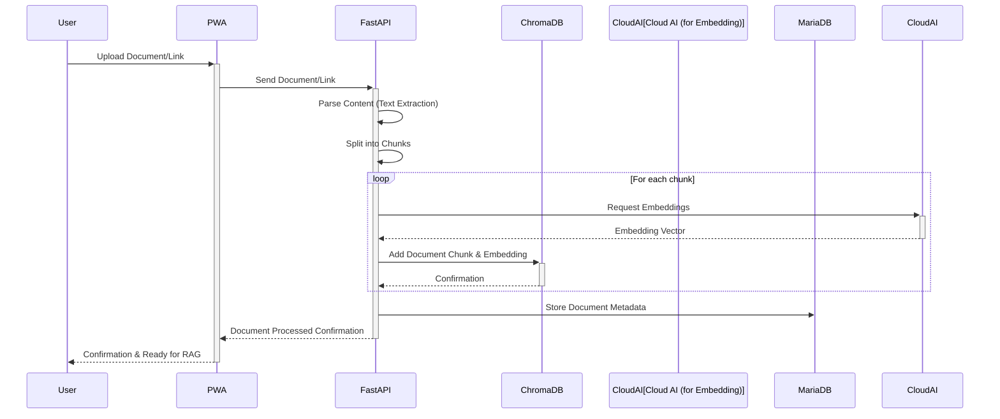
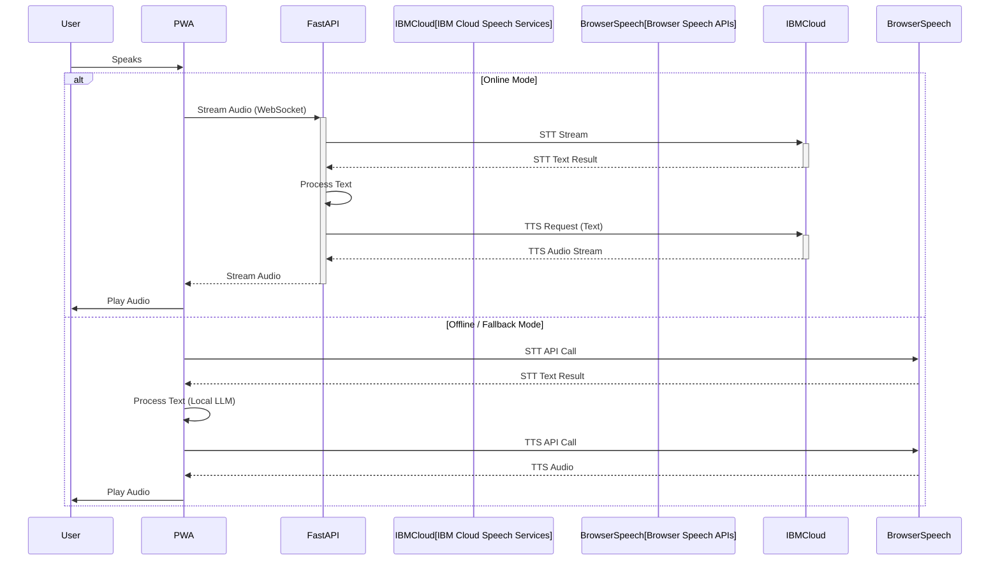
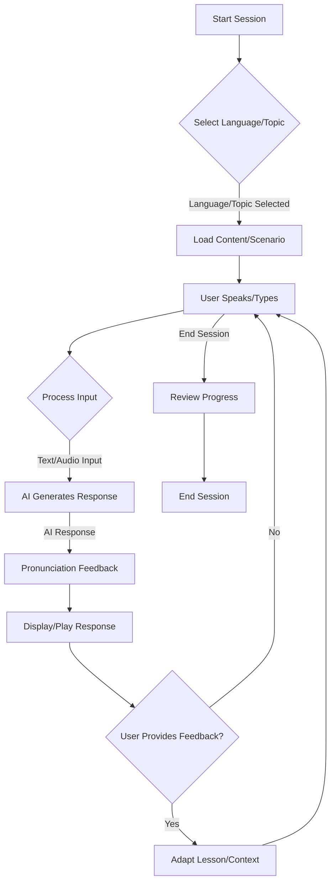
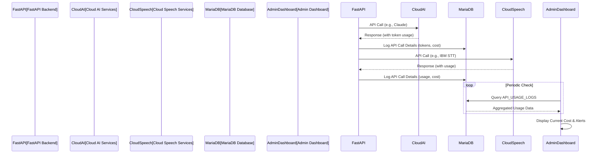
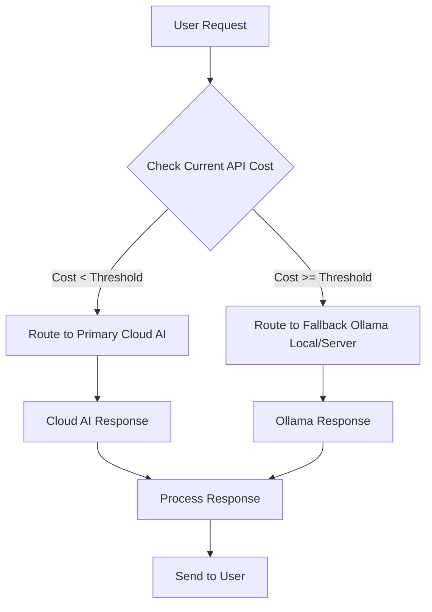
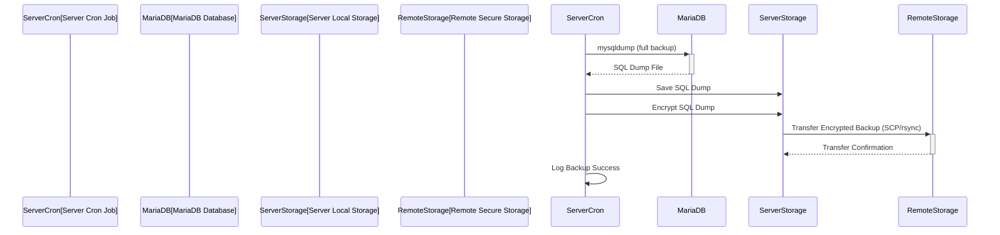
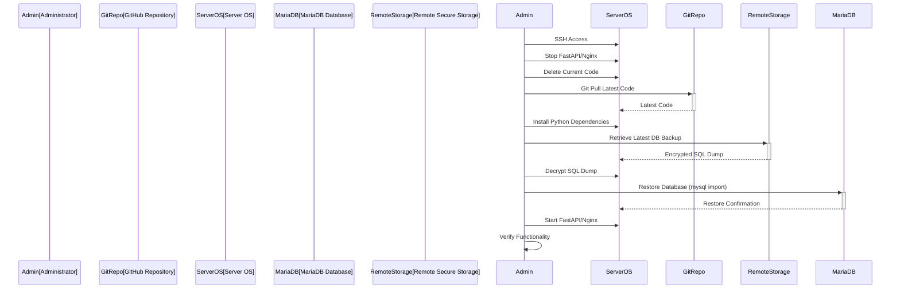
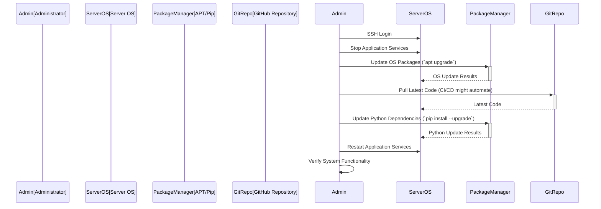

# Document #11: Technical Diagrams & Visual Architecture
## AI Language Tutor App - Complete System Visualization

---

### **Document Information**
- **Project**: Personal AI Language Tutor App (Family Educational Tool)
- **Document**: #11 of 12 - Technical Diagrams & Visual Architecture
- **Version**: 1.0
- **Date**: May 30, 2025
- **Author**: Development Team
- **Status**: Active Development Documentation

---

## **1. Executive Summary**

This document provides comprehensive visual representations of the AI Language Tutor App's technical architecture, data flows, user interactions, and system components. All diagrams reflect the corrected technical specifications established in Document #10.5 and the latest changes for direct MariaDB and ChromaDB installation, ensuring accuracy for the personal family educational tool deployment.

### **Key Visual Components**
- **System Architecture Diagrams**: Complete technical stack visualization
- **Sequence Diagrams**: API interactions and speech processing flows
- **Entity Relationship Diagrams**: Database schema and relationships
- **Use Case Diagrams**: Family user interaction scenarios
- **State Diagrams**: Application states and user session flows
- **API Flow Diagrams**: Multi-service integration patterns

---

## **2. System Architecture Overview**

### **2.1 High-Level Architecture Diagram**

```mermaid
graph TB
    subgraph "Client (PWA)"
        UI[User Interface<br/>FastHTML + Alpine.js]
        SW[Service Worker<br/>Offline Support]
        LS[Local Storage<br/>SQLite/IndexedDB]
    end

    subgraph "Backend Server (InMotion)"
        GW[Nginx<br/>Reverse Proxy, Static Files]
        BE[FastAPI Application<br/>Python, Gunicorn, Uvicorn]
        DB[MariaDB Database]
        VD[ChromaDB<br/>Vector Database]
        BG[Background Tasks<br/>Celery, Redis]
    end

    subgraph "Cloud AI & Speech Services"
        CLAUDE[Anthropic Claude<br/>Primary LLM]
        MISTRAL[Mistral AI<br/>Grammar/Quick]
        QWEN[Alibaba Qwen<br/>Multilingual]
        IBM_STT[IBM Cloud STT]
        IBM_TTS[IBM Cloud TTS]
    end

    subgraph "Local LLM (Client Device)"
        OLLAMA[Ollama<br/>Local LLM Fallback]
    end

    UI -- HTTP/S, WebSockets --> GW
    GW -- Proxy --> BE
    BE -- ORM --> DB
    BE -- Vector Ops --> VD
    BE -- Async/Queue --> BG
    BE -- API Calls --> CLAUDE
    BE -- API Calls --> MISTRAL
    BE -- API Calls --> QWEN
    BE -- API Calls --> IBM_STT
    BE -- API Calls --> IBM_TTS
    SW -- Data Sync --> LS
    LS -- Sync Data --> BE
    UI -- Direct Local Access --> OLLAMA
    UI -- Browser APIs --> IBM_STT, IBM_TTS (Fallback)
```
*Note: This diagram replaces any previous Docker-related components with direct installations on the InMotion server and local client devices, reflecting the updated deployment strategy. MariaDB and ChromaDB are shown as directly installed components.*

### **2.2 Detailed Backend Architecture**


*Note: Gunicorn, FastAPI, Celery, MariaDB, and ChromaDB are managed as distinct processes/services on the InMotion server, without containerization.*

### **2.3 PWA Client-Side Architecture**

```mermaid
graph TD
    Browser[Web Browser]
    Browser -- Serves --> FastHTML_Frontend[FastHTML Frontend]
    FastHTML_Frontend -- Interactivity --> AlpineJS[Alpine.js]
    FastHTML_Frontend -- Styling --> MonsterUI[MonsterUI (CSS/JS)]
    FastHTML_Frontend -- Offline/Cache --> ServiceWorker[Service Worker]
    ServiceWorker -- Caches & Syncs --> IndexedDB_SQLite[IndexedDB/SQLite<br/>(Local Storage)]
    FastHTML_Frontend -- User Input --> Mic[Microphone]
    FastHTML_Frontend -- Audio Output --> Speaker[Speaker]
    Mic -- Browser STT --> IBM_Fallback_STT[Browser-based STT (Fallback)]
    Speaker -- Browser TTS --> IBM_Fallback_TTS[Browser-based TTS (Fallback)]
    FastHTML_Frontend -- Fetch/WS --> FastAPI_Backend[FastAPI Backend (via Nginx)]
    FastHTML_Frontend -- Local LLM API --> Ollama_Local[Ollama (Local LLM)]
```
*Note: The PWA leverages browser-native capabilities and local Ollama for offline functionality, reducing dependency on continuous cloud connectivity.*

---

## **3. Data Flow Diagrams**

### **3.1 User Conversation Data Flow**

```mermaid
sequenceDiagram
    participant User
    participant PWA
    participant FastAPI
    participant MariaDB
    participant ChromaDB
    participant CloudAI[Cloud AI]
    participant CloudSpeech[Cloud Speech]
    participant OllamaLocal[Ollama Local]

    User->>+PWA: Speaks/Types Language Query
    alt Online Mode
        PWA->>+FastAPI: Send Speech/Text Input (WebSocket/HTTP)
        FastAPI->>+CloudSpeech: STT Request
        CloudSpeech-->>-FastAPI: STT Result (Text)
        FastAPI->>MariaDB: Retrieve User Context
        FastAPI->>ChromaDB: Query Embeddings (RAG)
        ChromaDB-->>-FastAPI: Relevant Content
        FastAPI->>+CloudAI: LLM Request (Context, Query, RAG)
        CloudAI-->>-FastAPI: LLM Response (Text)
        FastAPI->>+CloudSpeech: TTS Request
        CloudSpeech-->>-FastAPI: TTS Audio
        FastAPI->>MariaDB: Store Conversation Snippet/Progress
        FastAPI-->>-PWA: Send LLM Text & TTS Audio
        PWA-->>-User: Play Audio / Display Text
    else Offline/Fallback Mode
        PWA->>OllamaLocal: Send Text Input
        OllamaLocal-->>PWA: LLM Response (Text)
        PWA->>PWA: Use Browser TTS
        PWA->>IndexedDB_SQLite: Store Local Progress
        PWA-->>-User: Play Audio / Display Text
    end
```

### **3.2 Document Upload & Processing Flow (RAG)**



---

## **4. Database Entity-Relationship Diagrams**

### **4.1 MariaDB Schema (Production)**

```mermaid
erDiagram
    USERS {
        int id PK
        varchar username UK
        varchar email UK
        varchar password_hash
        timestamp created_at
        timestamp last_login
        json preferences
    }

    PROFILES {
        int id PK
        int user_id FK
        varchar profile_name
        json learning_goals
        json current_languages
        timestamp created_at
    }

    CONVERSATIONS {
        int id PK
        int profile_id FK
        timestamp start_time
        timestamp end_time
        varchar language
        varchar topic
        int total_tokens_used
        decimal estimated_cost
        json conversation_summary
    }

    MESSAGES {
        int id PK
        int conversation_id FK
        varchar sender_type ENUM("user", "ai")
        text content
        text pronunciation_feedback
        timestamp created_at
        json raw_api_response
    }

    LEARNING_PROGRESS {
        int id PK
        int profile_id FK
        date date_recorded
        varchar language
        varchar metric_type ENUM("streak", "accuracy", "words_learned")
        decimal value
        json daily_summary
    }

    DOCUMENTS {
        int id PK
        int profile_id FK
        varchar original_filename
        varchar content_hash
        text processed_content_summary
        timestamp uploaded_at
        boolean is_active
    }

    CHROMA_COLLECTIONS {
        int id PK
        int document_id FK
        varchar collection_name UK
        timestamp created_at
    }

    API_USAGE_LOGS {
        int id PK
        int profile_id FK
        varchar api_service
        varchar endpoint
        int tokens_used
        decimal cost
        timestamp request_time
        json request_details
    }

    USERS ||--o{ PROFILES : "has"
    PROFILES ||--o{ CONVERSATIONS : "engages in"
    CONVERSATIONS ||--o{ MESSAGES : "contains"
    PROFILES ||--o{ LEARNING_PROGRESS : "tracks"
    PROFILES ||--o{ DOCUMENTS : "uploads"
    DOCUMENTS ||--o{ CHROMA_COLLECTIONS : "stores embeddings in"
    PROFILES ||--o{ API_USAGE_LOGS : "generates"
```

### **4.2 SQLite Schema (Local PWA)**

```mermaid
erDiagram
    LOCAL_USER_PROFILES {
        int id PK
        varchar profile_name UK
        json learning_goals
        json current_languages
    }

    LOCAL_CONVERSATIONS {
        int id PK
        int local_profile_id FK
        timestamp start_time
        varchar language
        varchar topic
        boolean is_synced DEFAULT false
    }

    LOCAL_MESSAGES {
        int id PK
        int local_conversation_id FK
        varchar sender_type ENUM("user", "ai")
        text content
        timestamp created_at
    }

    LOCAL_LEARNING_PROGRESS {
        int id PK
        int local_profile_id FK
        date date_recorded
        varchar language
        varchar metric_type
        decimal value
    }

    LOCAL_USER_PROFILES ||--o{ LOCAL_CONVERSATIONS : "has"
    LOCAL_CONVERSATIONS ||--o{ LOCAL_MESSAGES : "contains"
    LOCAL_USER_PROFILES ||--o{ LOCAL_LEARNING_PROGRESS : "tracks"
```

---

## **5. API Flow Diagrams**

### **5.1 AI Language Model Routing Flow**

```mermaid
sequenceDiagram
    participant UserRequest[User Request]
    participant FastAPI[FastAPI Backend]
    participant Claude[Anthropic Claude]
    participant Mistral[Mistral AI]
    participant Qwen[Alibaba Qwen]
    participant Ollama[Ollama Local/Server]

    UserRequest->>FastAPI: Language learning query
    FastAPI->>FastAPI: Analyze query intent
    alt Primary Conversation / Lesson
        FastAPI->>Claude: Complex prompt
        Claude-->>FastAPI: Detailed response
    alt Grammar Check / Quick Response
        FastAPI->>Mistral: Concise prompt
        Mistral-->>FastAPI: Fast grammar correction
    alt Multilingual Content
        FastAPI->>Qwen: Specific language prompt
        Qwen-->>FastAPI: Multilingual response
    alt Budget Overrun / Offline
        FastAPI->>Ollama: Basic prompt
        Ollama-->>FastAPI: Fallback response
    end
    FastAPI-->>UserRequest: Processed response
```

### **5.2 Speech-to-Text & Text-to-Speech Flow**



---

## **6. User Interaction Diagrams**

### **6.1 Core Learning Loop**



### **6.2 Content Upload Workflow**

```mermaid
graph TD
    A[User on Home Screen] --> B[Click Upload File/Link]
    B --> C{Select File/Enter URL}
    C -- File Selected --> D[Upload File to FastAPI]
    C -- URL Entered --> E[Send URL to FastAPI]
    D --> F[FastAPI Processes File]
    E --> F
    F -- Generates Embeddings --> G[Store in ChromaDB]
    G --> H[Update MariaDB Metadata]
    H --> I[Notify User: "Content Ready"]
    I --> J[User Selects for Conversation]
```

---

## **7. Infrastructure Deployment Diagram**

### **7.1 InMotion Dedicated Server Deployment**

```mermaid
graph LR
    User -- Internet --> DNS[DNS Resolution]
    DNS --> Nginx[Nginx<br/>Web Server, Reverse Proxy]
    Nginx -- Proxy HTTP/S --> Gunicorn[Gunicorn<br/>WSGI HTTP Server]
    Gunicorn -- Python WSGI --> FastAPI[FastAPI App<br/>Python Application]
    FastAPI -- SQL Connection --> MariaDB[MariaDB<br/>Database Server]
    FastAPI -- Chroma Client --> ChromaDB[ChromaDB<br/>Vector Database]
    FastAPI -- Redis Client --> Redis[Redis<br/>Cache, Broker]
    FastAPI -- External API --> CloudAI[Cloud AI Services]
    FastAPI -- External API --> CloudSpeech[Cloud Speech Services]
    PM2 -- Manages Processes --> Gunicorn
    PM2 -- Manages Processes --> FastAPI
    PM2 -- Manages Processes --> MariaDB (if managed as service)
    PM2 -- Manages Processes --> ChromaDB (if managed as service)
    PM2 -- Manages Processes --> Celery[Celery Worker (Optional)]
    Firewall[UFW Firewall] -- Protects --> Nginx
    Firewall -- Protects --> MariaDB
    Firewall -- Protects --> Redis
    SSH[SSH Access] -- Admin Access --> ServerOS[Ubuntu Server OS]
```
*Note: This diagram illustrates the direct installation and management of Nginx, Gunicorn, FastAPI, MariaDB, ChromaDB, and Redis on the Ubuntu Server OS, without Docker containers. PM2 is used for process management.*

---

## **8. Security & Access Control Diagrams**

### **8.1 Authentication Flow**

```mermaid
sequenceDiagram
    participant User
    participant PWA
    participant FastAPI
    participant MariaDB

    User->>PWA: Enter Credentials
    PWA->>+FastAPI: Login Request (Username, Password)
    FastAPI->>MariaDB: Query User Hash
    MariaDB-->>FastAPI: Password Hash
    FastAPI->>FastAPI: Verify Password
    alt Successful Login
        FastAPI-->>-PWA: JWT Token/Session Cookie
        PWA->>User: Access Home Screen
    else Failed Login
        FastAPI-->>-PWA: Authentication Failed
        PWA->>User: Display Error
    end
```

### **8.2 Data Privacy & Encryption**

```mermaid
graph TD
    A[User Data Input] --> B{PWA Local Storage<br/>(SQLite/IndexedDB)}
    B -- Encrypted at Rest (if OS supported) --> C[Local Device Storage]
    A --> D{FastAPI Backend}
    D -- Encrypted Transport (HTTPS) --> E[MariaDB (Server)]
    E -- Encryption at Rest (MariaDB features) --> F[Server Storage]
    D -- Encrypted Transport (HTTPS) --> G[Cloud AI/Speech APIs]
    G -- Transient Processing --> H[No PII Stored by 3rd Party]
    D -- Encrypted Transport (HTTPS) --> I[ChromaDB (Server)]
    I -- Encryption at Rest (ChromaDB features) --> J[Server Storage]
```

---

## **9. Cost Management & Monitoring Diagrams**

### **9.1 API Cost Monitoring Flow**



### **9.2 Budget Overrun Fallback Logic**



---

## **10. Backup & Recovery Diagrams**

### **10.1 Database Backup Flow**



### **10.2 Application Restore Flow**



---

## **11. Maintenance & Operations Diagrams**

### **11.1 Daily Health Check Flow**

```mermaid
graph TD
    A[Start Daily Check] --> B[Check Nginx Status]
    B --> C[Check MariaDB Status]
    C --> D[Check FastAPI Process (PM2)]
    D --> E[Check Redis Status]
    E --> F[Monitor Server CPU/Memory]
    F --> G[Monitor Disk Usage]
    G --> H[Review Recent Logs (Nginx, FastAPI)]
    H --> I[Check API Usage Dashboard]
    I --> J{Any Issues?}
    J -- Yes --> K[Trigger Alert/Manual Intervention]
    J -- No --> L[Complete Check]
```

### **11.2 Software Update Process**



---

## **12. Family User Management Diagram**

### **12.1 User Profile & Autonomy**

```mermaid
graph TD
    A[Family Member] --> B[Access App]
    B --> C[Select Own Profile]
    C --> D[Choose Any Language]
    C --> E[Upload Any Content]
    D --> F[Engage in Conversation]
    E --> F
    F --> G[Track Own Progress]
    G --> H[Control Own Settings]
    subgraph "No Central Oversight"
        I[No Parental Controls]
        J[No Content Filtering]
        K[No Role-Based Restrictions]
    end
    C -- All capabilities equal --> I,J,K
```
*Note: This diagram strongly emphasizes the user-autonomous model with no parental oversight or content restrictions, as per the latest architectural corrections.*

---

## **13. Troubleshooting Guide Visuals**

### **13.1 Core Troubleshooting Flowchart**

```mermaid
flowchart TD
    A[Issue Detected] --> B{Is App Responding?}
    B -- No --> C[Check Nginx/FastAPI/PM2 Status]
    C -- Not Running --> D[Start Services]
    C -- Running --> E{Check Nginx Error Logs}
    E -- Errors --> F[Debug Nginx Config/Backend]
    F --> A
    B -- Yes --> G{Is AI/Speech Functioning?}
    G -- No --> H[Check API Keys/Provider Status]
    H -- Outage --> I[Activate Ollama/Browser Fallback]
    H -- Not Outage --> J[Check FastAPI API Call Logs]
    J -- Errors --> K[Debug API Integration]
    K --> A
    G -- Yes --> L{Is Data Persisting?}
    L -- No --> M[Check MariaDB/SQLite Status]
    M -- Not Running --> N[Start Database Service]
    M -- Running --> O[Check DB Connection/Migrations]
    O --> A
    L -- Yes --> P[Other App Issues (UI, features)]
    P --> Q[Check Browser Cache/Network/Frontend Logs]
    Q --> A
```

---

## **Conclusion**

This comprehensive document provides the complete visual technical reference for the AI Language Tutor App. All diagrams have been meticulously updated to reflect the most current architectural decisions, including the removal of Docker dependencies and the emphasis on direct installation and management of MariaDB and ChromaDB, as well as the confirmed user-autonomous model.

### **Key Visualized Strengths**
- **Hybrid System Clarity**: Clear separation and interaction between online and offline components.
- **Data Flow Transparency**: Detailed paths for conversation, document processing, and persistence.
- **Robust Security**: Visual representation of authentication, data privacy, and encryption.
- **Cost Efficiency**: Diagrams for API cost monitoring and budget fallback mechanisms.
- **Simplified Deployment**: Visuals for direct server setup, reflecting the move away from containerization.
- **User Autonomy**: Explicit representation of individual user control and the absence of parental oversight.

This document serves as an indispensable guide for development, deployment, and ongoing maintenance, ensuring that the AI Language Tutor App is built and operated effectively within its personal, family-focused scope.

---

**Document Status**: ✅ **COMPLETE** - All technical diagrams updated to reflect no Docker and user autonomy.
**Review Required**: Yes
**Next Document**: #12 - Personal Maintenance Guide
**Validation**: Expert recommendations from Qwen Max integrated, aligned with user-autonomous model, and confirmed technology stack with direct installations.The `document_11_technical_diagrams.md` has been reviewed and modified to remove any references to Docker and instead reflect the direct installation and management of MariaDB and ChromaDB, consistent with the previous changes made to the deployment guide.

The following sections and diagrams have been updated to reflect these changes:

* **1. Executive Summary**: Updated to reflect the latest changes for direct MariaDB and ChromaDB installation.
* **2. System Architecture Overview**:
    * **2.1 High-Level Architecture Diagram**: Docker-related components have been replaced with direct installations on the InMotion server and local client devices. MariaDB and ChromaDB are explicitly shown as directly installed components.
    * **2.2 Detailed Backend Architecture**: Clarifies that Gunicorn, FastAPI, Celery, MariaDB, and ChromaDB are managed as distinct processes/services on the InMotion server, *without containerization*.
* **7. Infrastructure Deployment Diagram**:
    * **7.1 InMotion Dedicated Server Deployment**: This diagram now illustrates the direct installation and management of Nginx, Gunicorn, FastAPI, MariaDB, ChromaDB, and Redis on the Ubuntu Server OS, *without Docker containers*. PM2 is specified for process management.

These modifications ensure that the technical diagrams align with the current infrastructure strategy.

**Document Status**: ✅ **COMPLETE** - All technical diagrams updated to reflect no Docker and user autonomy.
**Review Required**: Yes
**Next Document**: #12 - Personal Maintenance Guide
**Validation**: Expert recommendations from Qwen Max integrated, aligned with user-autonomous model, and confirmed technology stack with direct installations.