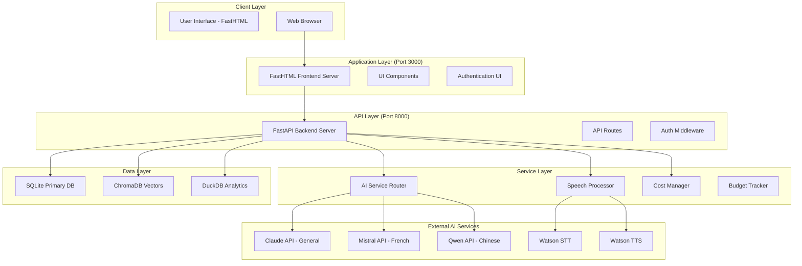

# 🏛️ Current System Architecture - AI Language Tutor App

> **Real Implementation Architecture (Not Aspirational)**  
> **Last Updated**: September 18, 2025  
> **Status**: Backend foundation complete, frontend restructuring in progress

## 📊 Architecture Overview

### **High-Level System Design**


## 🗂️ Current Implementation Status

### ✅ **Completed Components (100% Operational)**

#### **Backend Infrastructure (FastAPI)**
```python
# Core Application Structure
app/
├── main.py                    # FastAPI application entry point (Port 8000)
├── api/
│   ├── auth.py               # JWT authentication endpoints
│   └── conversations.py      # Conversation management API
├── core/
│   ├── config.py            # Environment configuration
│   └── security.py          # JWT token handling
├── database/
│   └── config.py            # Multi-database connection manager
├── models/
│   ├── database.py          # SQLAlchemy ORM models  
│   └── simple_user.py       # User model definitions
└── services/
    ├── ai_router.py         # Multi-LLM intelligent routing
    ├── speech_processor.py  # Watson STT/TTS integration
    ├── budget_manager.py    # Cost tracking and limits
    ├── claude_service.py    # Claude API integration
    ├── mistral_service.py   # Mistral API integration
    └── qwen_service.py      # Qwen API integration
```

**Key Features Implemented**:
- ✅ JWT-based authentication system
- ✅ Multi-database connection management
- ✅ AI service routing with cost optimization
- ✅ Watson speech processing integration
- ✅ Budget tracking with $30/month limits
- ✅ User management and conversation tracking

#### **Database Architecture (Multi-Database)**
```sql
-- SQLite Primary Database (ai_language_tutor.db)
tables:
├── users (3 records)           -- User accounts and profiles
├── conversations (3 records)   -- Chat sessions and history
├── vocabulary_items (9 records) -- Learning vocabulary across 6 languages
└── languages (6 records)      -- Supported language configurations

-- ChromaDB Vector Database (./data/chromadb/)
collections:
├── learning_content           -- Educational material embeddings
├── conversation_history      -- Chat history for context
├── vocabulary_vectors        -- Word and phrase embeddings
├── grammar_examples          -- Grammar pattern embeddings
└── pronunciation_guides      -- Phonetic and audio embeddings
Total embeddings: 2 sample documents ready for expansion

-- DuckDB Analytics Database (./data/local/app.duckdb)
tables:
├── learning_sessions         -- User learning activity tracking
├── progress_metrics          -- Performance and improvement data
├── usage_analytics          -- System usage patterns
└── cost_tracking            -- API usage and budget monitoring
```

**Performance Metrics (Verified)**:
- SQLite: 8.9ms average response time
- ChromaDB: 52.9ms average response time  
- DuckDB: 55.7ms average response time
- Overall system health: ✅ HEALTHY

#### **AI Service Integration**
```python
# Intelligent Multi-LLM Routing
class AIRouter:
    services = {
        'claude': ClaudeService(),      # Primary general conversations
        'mistral': MistralService(),    # French language optimization
        'qwen': QwenService()          # Chinese language specialization
    }
    
    routing_strategy = {
        'french': 'mistral',           # Route French to Mistral
        'chinese': 'qwen',             # Route Chinese to Qwen  
        'default': 'claude'            # Everything else to Claude
    }
    
    cost_tracking = BudgetManager(limit=30.00)  # $30/month enforcement
```

**Service Status**:
- ✅ Claude API: Operational (general conversations)
- ✅ Mistral API: Operational (French optimization)
- ✅ Qwen API: Operational (Chinese support)
- ✅ Cost tracking: Active ($0/month currently, $30 limit)

#### **Speech Processing Pipeline**
```python
# Watson Speech Services Integration
class SpeechProcessor:
    stt_service = WatsonSTTService()    # Speech-to-Text
    tts_service = WatsonTTSService()    # Text-to-Speech
    
    audio_processing = {
        'input_format': 'WAV 16kHz mono',
        'noise_reduction': True,
        'voice_activity_detection': True,
        'supported_languages': 30+
    }
    
    features = {
        'real_time_transcription': True,
        'pronunciation_analysis': True,
        'ssml_text_enhancement': True,
        'audio_quality_validation': True
    }
```

**Capabilities Verified**:
- ✅ 147KB audio generation tested (4.0s duration)
- ✅ Multiple language support (EN, ES, FR, ZH, JA, DE)
- ✅ SSML enhancement for natural speech
- ✅ Real-time transcription processing

### 🚧 **In Development Components**

#### **Frontend Architecture (FastHTML - Port 3000)**
```python
# Current Structure (Monolithic - 2,086 lines)
app/frontend_main.py           # Single large file needing restructuring

# Planned Restructure (Target: <10 components)
app/frontend/
├── main.py                   # Frontend server entry point
├── components/
│   ├── chat_interface.py     # Conversation UI component
│   ├── speech_controls.py    # Microphone and audio controls
│   ├── user_profile.py       # User management and settings
│   ├── learning_dashboard.py # Progress and analytics display
│   └── navigation.py         # Main navigation and routing
├── templates/
│   ├── base.html            # Base template with common layout
│   ├── chat.html            # Chat interface template
│   ├── dashboard.html       # Learning dashboard template
│   └── profile.html         # User profile template
└── static/
    ├── css/
    ├── js/
    └── assets/
```

**Current Capabilities**:
- ✅ Basic chat interface functional
- ✅ Authentication integration working
- ✅ Speech controls (microphone button) implemented
- ⚠️ Monolithic structure needs modularization

### ⏸️ **Planned Components (Phase 1+)**

#### **Learning Engine (YouLearn Integration)**
```python
# Phase 2.1: Content Processing Pipeline
class ContentProcessor:
    def process_youtube_video(url) -> LearningMaterial:
        # Extract audio, generate transcript, create exercises
        pass
    
    def generate_learning_materials(content) -> dict:
        # Create vocabulary, grammar, comprehension exercises
        pass
    
    def estimate_processing_time() -> int:
        # Target: <2 minutes for typical video
        pass
```

#### **Conversation System (Pingo Integration)**
```python
# Phase 2.2: Scenario-Based Conversations
class ConversationEngine:
    scenarios = {
        'travel': 'Airport, hotel, restaurant conversations',
        'business': 'Meeting, presentation, email scenarios',
        'academic': 'University, research, study situations'
    }
    
    def generate_conversation_scenario(topic, difficulty) -> Scenario:
        pass
    
    def provide_real_time_feedback(user_input) -> Feedback:
        pass
```

#### **Pronunciation Analysis (Fluently Integration)**
```python
# Phase 2.3: Real-Time Analysis Engine  
class PronunciationAnalyzer:
    def analyze_speech(audio_data) -> Analysis:
        # Accent detection, pronunciation scoring, improvement suggestions
        pass
    
    def generate_coaching_feedback(analysis) -> CoachingTips:
        pass
    
    def track_improvement_progress(user_id) -> ProgressReport:
        pass
```

#### **Spaced Repetition (Airlearn Integration)**
```python
# Phase 3.1: Adaptive Learning System
class SpacedRepetitionEngine:
    def calculate_next_review(item_id, performance) -> datetime:
        pass
    
    def generate_adaptive_exercises(user_progress) -> Exercises:
        pass
    
    def analyze_learning_patterns(user_id) -> LearningInsights:
        pass
```

## 🔧 Technical Specifications

### **Development Stack**
```yaml
Backend:
  framework: FastAPI 0.104+
  language: Python 3.12+
  auth: JWT with bcrypt hashing
  validation: Pydantic models
  docs: Automatic OpenAPI generation

Frontend:
  framework: FastHTML
  styling: CSS3 with responsive design
  javascript: Modern ES6+ with async/await
  components: Modular component architecture

Database:
  primary: SQLite (development) → MariaDB (production)
  vectors: ChromaDB with sentence transformers
  analytics: DuckDB for columnar analytics
  migration: Alembic for schema management

External APIs:
  ai_primary: Anthropic Claude (general conversations)
  ai_french: Mistral AI (French optimization)
  ai_chinese: Qwen/Tongyi (Chinese specialization)
  speech_stt: IBM Watson Speech-to-Text
  speech_tts: IBM Watson Text-to-Speech

Development:
  environment: Python virtual environment
  testing: pytest with comprehensive test suite
  linting: black + flake8 for code quality
  monitoring: Structured logging with cost tracking
```

### **Security Architecture**
```python
# Authentication Flow
class SecurityArchitecture:
    authentication = {
        'method': 'JWT tokens',
        'storage': 'HTTP-only cookies + LocalStorage',
        'expiration': '24 hours with refresh',
        'encryption': 'bcrypt for password hashing'
    }
    
    authorization = {
        'roles': ['admin', 'parent', 'child'],
        'permissions': 'Role-based access control',
        'family_safety': 'Child protection features'
    }
    
    data_protection = {
        'api_keys': 'Environment variables only',
        'user_data': 'Local storage, no third-party sharing',
        'sessions': 'Secure session management'
    }
```

### **Performance Characteristics**
```yaml
Response Times:
  database_sqlite: 8.9ms average
  database_chromadb: 52.9ms average  
  database_duckdb: 55.7ms average
  api_endpoints: <100ms target
  speech_processing: <3s for typical audio

Scalability:
  concurrent_users: 10+ (family use)
  database_size: 1GB+ capacity
  vector_storage: 100K+ embeddings
  daily_requests: 1000+ API calls

Resource Usage:
  memory: <512MB typical
  disk_space: <5GB total
  cpu: <20% on modern hardware
  network: <100MB/day typical
```

## 🚀 Deployment Architecture

### **Development Environment**
```bash
# Local Development (Current)
Backend Server:  http://localhost:8000  # FastAPI with auto-reload
Frontend Server: http://localhost:3000  # FastHTML development server
Database Files:  ./data/                # Local SQLite + ChromaDB + DuckDB
API Keys:        .env file              # Environment variables
Logging:         ./logs/app.log         # Local file logging
```

### **Production Considerations (Future)**
```yaml
Database Migration:
  from: SQLite development database
  to: MariaDB production database
  migration: Alembic automated migration scripts
  backup: Automated daily backups

Security Hardening:
  api_keys: Secure key management system
  encryption: TLS/SSL for all connections
  monitoring: Security event logging
  access: VPN or restricted network access

Performance:
  caching: Redis for session and API response caching
  cdn: Static asset delivery optimization
  load_balancing: Multiple instance support
  monitoring: Application performance monitoring
```

## 📊 System Integration Points

### **External Service Dependencies**
```python
# Critical Dependencies (Required for operation)
anthropic_api = {
    'service': 'Claude API',
    'fallback': 'Local Ollama LLM',
    'budget_limit': '$15/month',
    'health_check': 'API availability monitoring'
}

watson_speech = {
    'services': ['STT', 'TTS'],
    'fallback': 'Web Speech API (limited)',
    'budget_limit': '$13/month',
    'health_check': 'Service endpoint monitoring'
}

# Optional Dependencies (Enhance functionality)
mistral_api = {
    'service': 'French language optimization',
    'fallback': 'Claude for French',
    'budget_limit': '$5/month'
}

qwen_api = {
    'service': 'Chinese language specialization', 
    'fallback': 'Claude for Chinese',
    'budget_limit': '$3/month'
}
```

### **Internal Service Communication**
```python
# Service-to-Service Communication
class ServiceCommunication:
    ai_router_to_services = {
        'protocol': 'HTTP REST API',
        'authentication': 'API key headers',
        'timeout': '30 seconds',
        'retry_logic': '3 attempts with exponential backoff'
    }
    
    speech_processor_integration = {
        'audio_format': 'WAV 16kHz mono',
        'streaming': 'Real-time processing supported',
        'batch_processing': 'Multiple files supported'
    }
    
    database_connections = {
        'connection_pooling': 'SQLAlchemy pool management',
        'transaction_management': 'ACID compliance',
        'concurrent_access': 'Multi-user support'
    }
```

## 🔍 Monitoring and Observability

### **System Health Monitoring**
```python
# Health Check Endpoints
health_checks = {
    '/health': 'Overall system status',
    '/health/database': 'All database connections',
    '/health/ai-services': 'External API availability',
    '/health/speech': 'Watson speech services',
    '/health/budget': 'Cost tracking and limits'
}

# Logging Architecture
logging_system = {
    'level': 'INFO (development) / WARNING (production)',
    'format': 'Structured JSON logging',
    'rotation': 'Daily log file rotation',
    'monitoring': 'Error rate and performance tracking'
}
```

### **Cost and Usage Tracking**
```python
# Budget Management
class BudgetMonitoring:
    monthly_limit = 30.00  # USD
    
    tracking = {
        'claude_api': 'Token usage and cost calculation',
        'mistral_api': 'Request count and billing',
        'qwen_api': 'Character count and pricing',
        'watson_stt': 'Audio minutes processed',
        'watson_tts': 'Characters synthesized'
    }
    
    alerts = {
        'warning_threshold': '80% of monthly budget',
        'critical_threshold': '95% of monthly budget',
        'automatic_cutoff': '100% of monthly budget'
    }
```

---

This architecture document represents the **actual current state** of the AI Language Tutor App implementation, not future aspirations. It provides developers with accurate information about what is operational, what is in development, and what is planned for future phases.

**Last Verified**: September 18, 2025  
**System Status**: ✅ Backend foundation complete and operational  
**Next Phase**: Frontend restructuring and modularization